# Avaliação Nutricional

Equivalência **Z-Score** e **Percentil**

| Z-Score   | -3   | -2  | -1  | 0   | +1  | +2  | +3    |
| --------- | ---- | --- | --- | --- | --- | --- | ----- |
| Percentil | p0,1 | p3  | p15 | p50 | p85 | p97 | p99,9 |
## Curvas da OMS
- Peso por Idade (0-10 anos)
- Estatura para a Idade (0-19 ano)
- Peso para a Estatura (0-5 anos)
- IMC por Idade (0-5 anos) e (5-10 anos)

```mermaid
---
displayMode : compact
---
gantt
	title Parâmetros OMS
	dateFormat s
	axisFormat |
	tickInterval 1second
	
	section Z-Score
	    -3      : milestone, zn3, 1, 0s
	    -2      : milestone, zn2, 2, 0s
	    -1      : milestone, zn1, 3, 0s
		0       : milestone, z0,  4, 0s
		+1      : milestone, z1,  5, 0s
		+2      : milestone, z2,  6, 0s
		+3      : milestone, z3,  7, 0s
	section P/I
		Muito BP : a1, 0, 1
		BP       : a2, after a1, 2
		Adequado : a3, after a2, 6
		Elevado  : a4, after a3, 8
	section E/I
		Muito BE : b1, 0, 1
		BE       : b2, after b1, 2
		Adequado : B3, after b2, 8
	section P/E
		M. Acentuada      : c1, 0, 1
		Magreza           : c2, after c1, 2
		Eutrófico         : c3, after c2, 5
		R. Sobrepeso      : c4, after c3, 6
		Sobrepeso         : c5, after c4, 7
		Obesidade         : c6, after c5, 8
	section IMC <5a
		M. Acentuada      : d1, 0, 1
		Magreza           : d2, after d1, 2
		Eutrófico         : d3, after d2, 5
		R. Sobrepeso      : d4, after d3, 6
		Sobrepeso         : d5, after d4, 7
		Obesidade         : d6, after d5, 8
	section IMC >5a
		M. Acentuada      : e1, 0, 1
		Magreza           : e2, after e1, 2
		Eutrófico         : e3, after e2, 5
		Sobrepeso         : e4, after e3, 6
		Obesidade         : e5, after e4, 7
		Ob. Grave         : e6, after e5, 8
```

# Desnutrição Grave

### Etiologias
- **Primária**: Baixa ingestão energética
- **Secundária**
	- Menor Absorção
	- Maior gasto energético

### Diagnóstico
- Magreza Acentuada ou
- Circunferência Braquial < 115mm (6m - 5a) ou
- Edema periférico

## Marasmo
- **Deficiência Nutricional Total** (Proteína, nutrientes, micronutrientes, ferro)
- Mais Comum em <1 ano
- Instalação Insidiosa (Quadro Crônico)
	- Retira energia dos tecidos
		- **Perda do Tecido Subcutâneo**
		- **Hipotrofia Muscular e Hipotonia**
- Irritabilidade | Apetite Preservado
- Anemia Ferropriva

Características -> Bola de Bouchard

## Kwashiorkor
A "doença do primeiro filho" -> Desmame do Seio Materno, perdendo aporte proteico em uma tribo africana.
- **Deficiência de Proteínas** -> **Edema** (perda para 3º espaço)
- Mais comum em > 2 anos
- Instalação rápida
- Subcutâneo preservado
	- Hepatomegalia (guarda gordura)
- Apatia e Hipoatividade -> **Maior Gravidade**
- Dermatoses: "**Flaky Paint**" (rachadura na pele)
- Cabelos: Quebradiços e "**Sinal da Bandeira**"
	- Áreas hipopigmentadas em meio a normopigmentadas.

|                        | **Marasmo** | **Kwashiorkor** |
| ---------------------- | ----------- | --------------- |
| **Carência**           | Global      | Proteínas       |
| **Edema**              | Ausente     | Presente        |
| **Dermatoses**         | Raro        | Comum           |
| **Gordura Subcutânea** | Consumida   | Preservada      |
## Tratamento
Feito em 3 momentos

- **1º Momento**: Estabilização
	- Prevenir e Tratar
		- Hipoglicemia
		- Hipotermia
		- Desidratação
			- Hidratar VO - ReSoMal (Balanceada)
		- Eletrólitos (Exceto Sódio) (Na escondido em Cels. por falta de Bomba funcional, volta após melhora)
		- Infecções (Imunocomprometido) -> **ATB sempre**
	- Repor Micronutrientes
		- **Não repor Ferro agora** -> Produz muito Radical Livre
	- Dieta Normocalórica / Normoproteica -> Evitar **Síndrome de Realimentação**
		- Aumenta muito insulina, mas células estão em estado metabólico ruim
		- Faz Hipocalemia e **Hipofosfatemia**
- **2º Momento**: Reabilitação
	- Dieta Hiperproteica e Hipercalórica (Catch Up - Ganhar peso)
	- Reposição de Ferro
	- Preparar para a Alta
- **3º Momento**: Acompanhamento
	- Pesagens regulares
	- Prevenir Recaída (Avaliar alimentação)

obs.: Kwashiorkor-Marasmático -> Mistura de sintomas

# Obesidade
- Primária: Alta ingesta energética
- Secundária: Hipotireoidismo, drogas, etc.

### Diagnóstico

| Comorbidade           | Avaliação                |
| --------------------- | ------------------------ |
| HAS                   | PA                       |
| DM                    | Glicemia                 |
| Dislipidemia          | CTF/TGL                  |
| Esteatose Hep.        | TGP (ou USG Hep.)        |
| Sd. Metabólica (>10a) | Circunferência Abdominal |
### Tratamento
- Medidas Comportamentais
	- Alimentação
	- Atividade Física

# Baixa Estatura

- Estatura: < Z-2 (P3%)
- Velocidade de Crescimento
	- Escolar: >= 5 cm/ano
- Alvo Genético
	- Meninas -> (Est Pai - 13 + Est Mãe) / 2
	- Meninos -> (Est Pai + Est Mãe + 13) / 2
- Idade Óssea
	- Atrasada >= 2 anos atrás da IC

## Etiologias
- Variantes Fisiológicas
	- Baixa Estatura Familiar
		- Estatura Baixa
		- Dentro do Canal/Alvo genético Baixo
		- Velocidade Normal
		- Idade óssea normal
	- Atraso Constitucional do Crescimento e Prematuridade
		- Estatura Baixa
		- Velocidade normal
		- Alvo Genético Normal
			- Canal é baixo no início e dá um estirão.
		- Idade Óssea Reduzida (< Idade Cronológica). Pelo menos 2 anos
- Condições Patológicas
	- Desnutrição
		- **Primária**
		- **Secundária**
	- Endócrinas
		- **Hipotireoidismo**
		- Deficiências de Gh
		- Hipercortisolismo
	- Genéticas
		- Sd. de Turner (45 X)
			- Baixa estatura
			- Atraso Puberal
			- Pescoço alado
			- Hipertelorismo Mamário
			- Cúbito Valgo
			- Coarctação da Aorta
		- Displasia Óssea
			- Acondroplasia
				- BE desproporcional (Segmento superior > Segmento Inferior)

## Investigação
- Fluxograma
	1. Avaliar Estatura e **Velocidade de Crescimento**
		- BE + VC Normal -> Fisiológica
			- IO = IC -> BE Familiar
			- IO < IC -> ACCP
		- BE + VC Reduzida ou Outras Alterações -> Causas Patológicas
			- Feminino -> Pedir Cariótipo
			- Alt. Fenotípica -> Sd. Genética
			- Obesa/Eutrófica -> Endócrina
			- Emagrecida -> Desnutrição